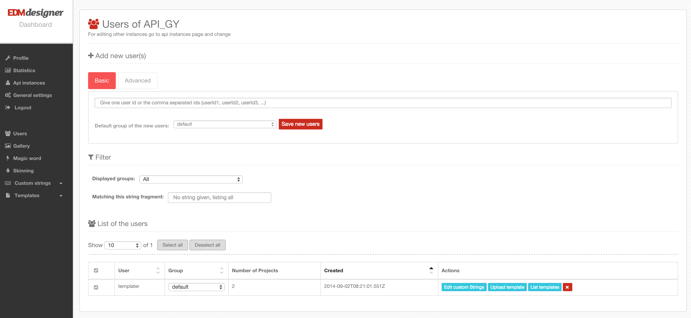

#Overview

In this article you can read about the basic functionalities of EDMdesigner’s dashboard, the basics of the API’s authentication and authorization, and you will be able to use some basic functionalities related to users and projects, including opening a template in the editor.

In the following few tutorial posts I will talk about integrating EDMdesigner into an arbitrary web-based system. I will provide simple and very typical use-cases, with which you will encounter very likely. By reading the tutorial posts, you will be able to create a basic integration with gallery handling, using built-in templates, customizing your workflow with custom data and you will be able to use admin related actions. Also, you will be familiar with our dashboard, since in lot of cases it’s more handy to use that.

In this article I will talk about how to start the integration. You will learn about:

 - some of the basic functionalities of our dashboard
 - the basic concepts of token generation
 - you will be able list the projects of a user
 - and finally our app will be able open those projects.


# Get access to our dashboard
That is the first and most important thing. At the moment, you need to write an email to support ~AT~ edmdesigner.com or more preferably to roland ~AT~ edmdesigner.com and we will create an API user for you. Later, we will enable users to register.


# Create an API key
Although you will have an API key by default, I suggest you to create one for development purposes, this way there won’t be dummy data under your real API key. When you log in to the dashboard, you will see the following screen:

<a href="./images/dashboard01.png" target="_blank"></a>

Your API keys will be listed by default, which you can always reach when you click on “Api instances” in the menu on the left hand side. As you can see, there are a few API keys under my account. You can create as many keys as you want. During these articles, I will use API_GY. I suggest you to create an API key for development purposes. Its name can be YOUR_COMPANY_DEV or something based on that pattern.


# The magic word
When you have your brand new API key, the next most important thing is to have the corresponding magic word. You can find it under the “Magic word” menu item on the left. The magic word will be used to generate a token which is the basis of authorization in our API.

<a href="./images/dashboard02.png" target="_blank"></a>

On this view, you also can regenerate your magic word, which I already did, so don’t even try to mess with my API key... ;)


# Users and the “templater” user

The next thing is to check out the users. By default, there is a special user associated to every API key, and its name is “templater”. You can’t delete this user, because this is the way to create default (or built-in) templates. If this user has templates, every other user in the system are able to create new templates based on these. This way you can provide some predefined templates to your users and they don’t have to start always from scratch.

<a href="./images/dashboard03.png" target="_blank"></a>


As you can see, “templater” is the only user which is associated to API_GY at the moment. You can create new users on this view, I suggest you to create a user which name is “test”. I will use that user name as well in my examples. User names must be unique per API key, so later it is suggested to use your users database id or their email address or something else which is unique.

As you can see it is possible to upload templates to users. (See the upload template button next to each users.) The templates are in a special JSON format, which is defined by us. Also, you can download templates in this format, so if you want to copy a template to a user you can do it by downloading from one and uploading it to another user.

Also, it is possible to purchase templates from us, and you can even order very, very custom templates which we can prepare for you.
If you have reached this point, then everything is set up to start to play around with the API and start coding! In the code examples on the server side I will use PHP, since – almost – everyone can at least read that language. The client side part of the code will always be in a script tag. You just need to copy them into your html file to play around a little bit. (You might always want to overwrite the preveious example.)

You can switch between the html and the php parts of the example by clicking on the corresponding tabs on the right hand side at the top of the page.


**Coding time!**


# Token generation and the Javascript API

```html
<script src="path_to_your_jquery"></script>
<!-- at the moment, our JS API depends on jQuery... -->
<script src="http://api-static.edmdesigner.com/EDMdesignerAPI.js"></script>
```

```php
//token.php
<?php
if ($_POST["userId"]) {
	$publicId = "YOUR_DEV_API_KEY";
	$magic = "YOUR_MAGIC_WORD";

	$ip = $_SERVER["REMOTE_ADDR"];
	$timestamp = time();

	$hash = md5($publicId . $ip . $timestamp . $magic);

	$url = "http://api-a.edmdesigner.com/api/token"; //In real life, you should implement
	//a fail over mechanism to api-b.edmdesigner.com and api-c.edmdesigner.com

	//Also, make some authorization based on data in your session,
	//because there is a chance that someone tries to be tricky.
	//For example you might want to prevent most of your users
	//to edit templater's projects...

	$data = array(
		"id"	=> $publicId,
		"uid"	=> $_POST["userId"],
		"ip"	=> $ip,
		"ts"	=> $timestamp,
		"hash"	=> $hash
	);

	// use key 'http' even if you send the request to https://...
	$options = array(
	    "http" => array(
	        "header"  => "Content-type: application/x-www-form-urlencoded\r\n",
	        "method"  => "POST",
	        "content" => http_build_query($data),
	    ),
	);

	$context  = stream_context_create($options);
	$result = file_get_contents($url, false, $context);

	print($result);
}
?>
```

The easiest and the fastest way of integration is to use our [Javascript API](http://api-static.edmdesigner.com/EDMdesignerAPI.js), which you can reach at https://api-static.edmdesigner.com/EDMdesignerAPI.js. This endpoint (api-static.edmdesigner.com) points to Amazon's CDN (Cloudfront), so it should be super fast to download the JS API from all over the world. It is dependent on jQuery, so you should include that previously.

If you have the JS API script included, then you will have function called initEDMdesignerPlugin. (Sorry for the naming, it is not really a plugin.) This function has three parameters.

```html
<script>
	//you can take a look at token.php if you change to the php tab
	initEDMdesignerPlugin("token.php", "templater", function(edmDesignerApi) {
	  //actual calls on edmApi's functions... eg. listing, opening projects, etc.
	});
</script>
```

Param | Description
---|---
route | This is where you implemented your part of the token generation. You can see an example for that if you change to the php tab.
userId | The id of the user you want to use. In the example we try the built-in templater user.
callback | The callback which is called when everything was fine with the token generation. The param of this function is an object with the reachable API functionalities as functions.

The initEDMdesignerPlugin function will send a HTTP POST request to the route which you gave as first parameter. If everything goes well the result should be the token with which will be sent with every request to the API server. In the example we generated an access token for the templater user.

A very good thing in the JS API is that there is a built-in failover mechanism. It means that if one of our end-points is not reachable for whatever reason, then it will retry the request using the next end-point. If you don't use our JS API, you should implement the fail over mechanism by yourself. Also, on the server side it' is highly recommended as well, although in our example it's not implemented. (We wanted to keep our examples as simple as possible for easier understanding.) At the moment we have the following API end-points:

 - api-a.edmdesigner.com
 - api-b.edmdesigner.com
 - api-c.edmdesigner.com

In the example, we generate an access token for the "templater" user. This means that if you call the functions on the edmDesignerApi object, than you will act in the name of the templater user. This user's projects will be the built-in templates in the system. By assingning projects to this user, you can provide a default set of projects to your users.

Now, please switch to the [php tab](?php#token-generation-and-the-javascript-api) and take a look at the example implementation of the token generation. You should implement something like this on your server side.

In the example, $publicId should be your API key and the $magic variable should contain the corresponding magic word, which you can find on the dashboard. Basically you have to send to one of our api end-points your API key (id), userId of your actual user (uid), your server’s ip address (ip), the actual timestamp (ts) and the md5 hash of the concatenation of your API key, your server’s ip address, the actual timestamp and the magic word. If everything goes well, you will receive a json with a token property in it, otherwise you will receive a 403 HTTP status code. The example implementation sends back the fetched token to the client side, so EDMdesignerAPI.js can concatenate it to every request.


## Create an example project

```html
<script>
    initEDMdesignerPlugin("token.php", "templater", function(edmDesignerApi) {
        edmDesignerApi.createProject(function({title: "test-title", description: "test-desc", document: {}}, result) {
            console.log(result._id);
        });
    }, function onErrorCB(error) { console.log(error); });
</script>
```

```php
//Please switch back to the html tab.
```

Now you can try to create an empty project to the “templater” user with the following code snippet:


## List the projects

```html
<script>
    initEDMdesignerPlugin("token.php", "templater", function(edmDesignerApi) {
        edmDesignerApi.listProjects(function(result) {
            console.log(result);
        });
    }, function onErrorCB(error) { console.log(error); });
</script>
```


You can check out on the dashboard if the project is really created or not. Also, you can break into the callback of initEDMdesignerPlugin with the debugger and check out what kind of functions are there on the edmApi object. An other way to check out if new projects are really created to the “templater” user is to change the code snippet above to the following one:


## Use a different user

```html
<script>
    initEDMdesignerPlugin("token.php", "test", function(edmDesignerApi) {
        edmDesignerApi.getDefaultTemplates(function(result) {
            //the result is an array, containing your default projects
        }, function onErrorCB(error) { console.log(error); });
    });
</script>
```

By now, you have probably figured out that you can call the initEDMdesignerPlugin function with other user names as well, for example with the one you previously created on dashboard. In my case it’s “test”. You can call all the functions with this user just like you did with “templater”. One very good feature of the “templater” user is that its projects are accessible for all of the users associated with the actual api key. It is possible with the [getDefaultTemplates](./index.html#project-list-defaults) function. This way it’s very easy to create a new template based on one of the “templater” user’s templates with the [createFromDefaults](./index.html#project-create-from-defaults) function.


## Open a project in editor

```html
<script>
    initEDMdesignerPlugin("token.php", "test", function(edmDesignerApi) {
        edmDesignerApi.createProject({title: "test-title", description: "test-desc"}, function(result) {
            edmDesignerApi.openProject(result._id, function(result) {
                $("body").append(result.iframe);
            });
        });
    }, function onErrorCB(error) { console.log(error); });
</script>
```

 The very last thing is to open a project. Once you have the _id of the project what you want to open, then it’s easy as a pie. In the code example we create a project and we open it immediately.

In the example, we directly append an iframe provided by the result object to the end of the body. It is not the only way, there is an src property as well on the result object, making it handy to set the same property of an existing iframe in your dom. You can learn more about the editor's iframe in our [docs](./index.html#editor-iframe).
